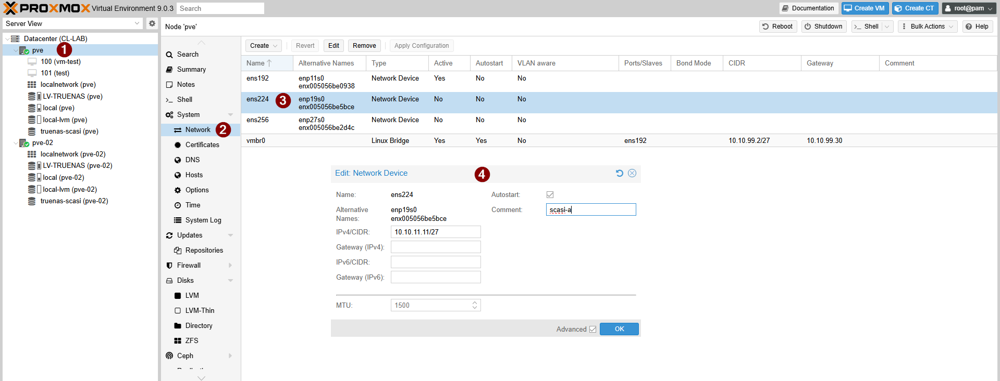
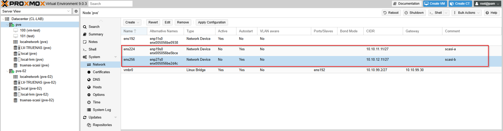
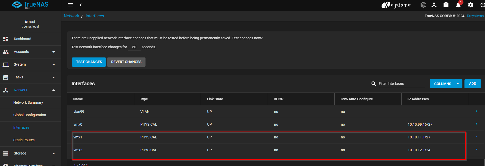

---
Lo que no se paga en licencias, se paga en horas de sueño del equipo de TI.

---
En esta guía veremos cómo configurar **almacenamiento compartido con iSCSI y multipath** en un entorno **Proxmox VE**.  
El laboratorio usaremos **TrueNAS** como almacenamiento, simulando un escenario real de alta disponibilidad con multipath.

### Escenario general
Para el entorno se crean **dos VLANs dedicadas a iSCSI** con el fin de separar dominios de colisión hacia las LUN.  
Tanto los hosts como el NAS contarán con una interfaz en cada VLAN.
De esta forma, **cada host tendrá dos rutas (paths)** hacia cada LUN presentada por iSCSI, las cuales serán gestionadas mediante **Multipath** en Proxmox VE.
En entornos productivos, lo ideal es contar con **dominios de falla completamente separados**, es decir:
- Una tarjeta de red dedicada por cada path en el host  
- Un switch independiente por cada path  
- Y dos controladores en el almacenamiento.

### Detalles de red
| Dispositivo | VLAN | Red | IP |
|--------------|------|-----|----|
| NAS | iSCSI-A | 10.10.11.0/27 | 10.10.11.1 |
| NAS | iSCSI-B | 10.10.12.0/27 | 10.10.12.1 |
| PVE-01 | iSCSI-A | 10.10.11.0/27 | 10.10.11.11 |
| PVE-01 | iSCSI-B | 10.10.12.0/27 | 10.10.12.11 |
| PVE-02 | iSCSI-A | 10.10.11.0/27 | 10.10.11.12 |
| PVE-02 | iSCSI-B | 10.10.12.0/27 | 10.10.12.12 |

### Configuración inicial de red
Se asume que la red y las VLANs ya fueron configuradas en el entorno VMware o físico.  
Desde el **cluster de Proxmox**, iniciamos sesión y configuramos las interfaces de red en cada host según la topología definida.




Realizamos lo mismo en el **NAS (TrueNAS)** para que tenga conectividad en ambas VLANs.


### Validar conectividad
Verificamos la comunicación entre los hosts y el NAS dentro de las VLANs dedicadas (`iscsi-a` y `iscsi-b`).  
Una vez comprobada la conectividad, se agregan las **LUN iSCSI** correspondientes a cada path (A y B) en ambos hosts.


### Instalar herramientas de multipath
En cada host del cluster, instalamos los paquetes necesarios:
```bash
apt-get update
apt-get install multipath-tools

lsblk
iscsiadm -m session
/lib/udev/scsi_id -g -u -d /dev/sdX
```
Creamos o editamos el archivo /etc/multipath.conf y agregamos los WWID de cada path con su alias correspondiente.
En este ejemplo se usa política de round robin con preferencia para el path iscsi-a.

```bash
multipaths {
  multipath {
        wwid "36589cfc000000370b5ac658dd2b969b3"
        alias mpath-a
  }
  multipath {
        wwid "36589cfc000000641545e08fb6373384a"
        alias mpath-b
  }
}

defaults {
        polling_interval        2
        path_selector           "round-robin 0"
        path_grouping_policy    failover
        uid_attribute           ID_SERIAL
        rr_min_io               100
        failback                immediate
        prio                    iet
        prio_args               preferredip=10.10.11.1
        no_path_retry           queue
        user_friendly_names     yes
}
```
Agregamos los WWID al archivo /etc/multipath/wwids y reiniciamos el servicio:
```bash

multipath -a 36589cfc000000370b5ac658dd2b969b3
multipath -a 36589cfc000000641545e08fb6373384a

systemctl restart multipath-tools.service
multipath -ll
```

Una vez configurado el multipath en todos los hosts, creamos un volumen LVM sobre el dispositivo iSCSI.
Este paso se realiza solo desde un host del cluster.


Finalmente, el volumen compartido aparece agregado al cluster y es accesible desde todos los nodos.