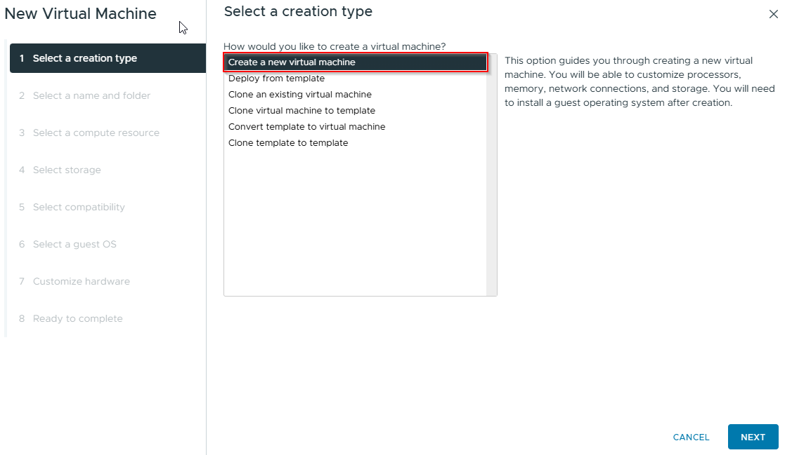

+++ 
draft = true
date = 2025-10-24T14:00:07-03:00
title = "Instalación de Proxmox VE 9 en VMware vSphere"
description = ""
slug = ""
authors = []
tags = ["virtualizacion", "proxmox"]
categories = []
externalLink = ""
series = []
+++
---

Proxmox Virtual Environment (VE) es una plataforma de virtualización de código abierto muy utilizada en entornos empresariales, ya que permite la administración de máquinas virtuales y contenedores de forma centralizada.  
En esta guía veremos cómo instalar Proxmox VE 9 sobre un entorno VMware vSphere.

---

## Crear la Máquina Virtual

Desde vCenter seleccionamos la opción "Crear nueva máquina virtual".

---

Ingresamos un nombre descriptivo para la VM y seleccionamos la ubicación correspondiente.

`img2.jpg`

---

Seleccionamos el datastore donde se almacenará la máquina virtual.

`img3.jpg`

---

En Sistema operativo invitado seleccionamos:

- Familia: Linux  
- Versión: Ubuntu Linux (64-bit) o la versión Linux más actual

`img4.jpg`

---

## Configuración de Hardware

Asignamos los recursos según disponibilidad:

- CPU: mínimo 2 vCPU  
- RAM: mínimo 4 GB (ideal 8 GB o más)  
- Habilitar virtualización asistida por hardware  

`img5.jpg`

---

Adjuntamos la ISO de Proxmox VE 9 al lector de CD/DVD y finalizamos el asistente.

`img6.jpg`

---

## Instalación de Proxmox

Encendemos la VM y arrancamos desde la ISO.

`img7.jpg`

---

Seleccionamos la opción:

Install Proxmox VE

`img8.jpg`

---

Aceptamos los términos de licencia.

`img9.jpg`

---

Elegimos el disco donde se instalará Proxmox.

`img10.jpg`

---

Seleccionamos zona horaria y configuración de teclado.

`img11.jpg`

---

Ingresamos las credenciales para el usuario root:

- Contraseña
- Email para notificaciones

`img12.jpg`

---

Configuramos la red para la interfaz de administración.  
En este ejemplo se utiliza la red 10.10.99.0/27.

`img13.jpg`

---

Iniciamos la instalación seleccionando instalar.

`img14.jpg`

---

## Acceso a la consola web

Una vez finalizada la instalación, podemos acceder desde un navegador ingresando a https://<IP-del-servidor>:8006, nos autenticamos con las credenciales previamente creadas.

`img15.jpg`

---

Con esto, Proxmox VE 9 ya está instalado en VMware vSphere.  

En próximos posts se podrá ver:

- Configuraciones iniciales recomendadas
- Creación de máquinas virtuales
- Gestión de contenedores LXC
- Configuración de almacenamiento y backups

---

